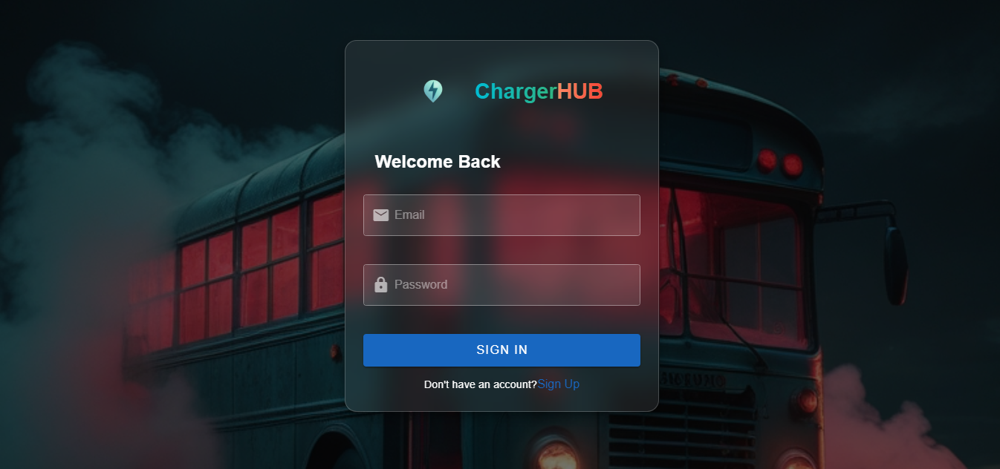
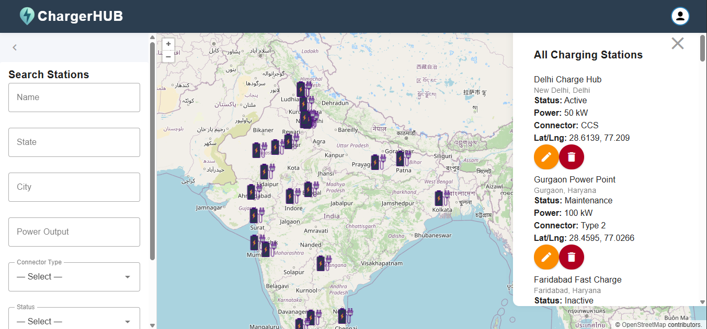

# EV Charging Stations App

A full-stack web application for managing and discovering EV charging stations.  
This project includes both a **Node.js/Express backend** and a **Vue 3 + Vuetify frontend**.

---

<div align="center">


</div>

---

## Features

- User registration and login with JWT authentication
- Role-based access control (admin, user)
- CRUD operations for charging stations (admin only)
- Search and filter stations
- Interactive map with attractive station markers
- Responsive, modern UI with Vuetify and OpenLayers
- Input validation and error handling

---
<!-- 
<div align="center">





</div>
  
</p> -->

<!-- **(Add your own screenshots in `frontend/public/screenshots/` for best results)** -->

---

## Project Structure

```fs
.
├── backend/
│   ├── .env
│   ├── index.js
│   ├── package.json
│   ├── config/
│   ├── middleware/
│   ├── models/
│   └── routes/
├── frontend/
│   ├── package.json
│   ├── src/
│   ├── public/
│   └── ...
└── README.md
```

---

## Backend

### Tech Stack

- Node.js, Express
- MongoDB (Mongoose)
- JWT authentication
- Role-based access

### Setup

1. **Navigate to backend folder:**

   ```sh
   cd backend
   ```

2. **Install dependencies:**

   ```sh
   npm install
   ```

3. **Configure environment variables:**
   Create a `.env` file in the backend root:

   ```env
   JWT_SECRET=your_jwt_secret
   DB_URI=your_mongodb_connection_string
   ```

4. **Start the server:**

   ```sh
   node index.js
   ```

   The backend runs on [http://localhost:3000](http://localhost:3000) by default.

### API Endpoints

- `POST /api/register` — Register a new user
- `POST /api/login` — Login and receive JWT token
- `GET /api/charging-stations` — List all charging stations
- `GET /api/charging-stations/:id` — Get a charging station by ID
- `POST /api/charging-stations` — Add a new charging station (admin only)
- `PUT /api/charging-stations/:id` — Update a charging station (admin only)
- `DELETE /api/charging-stations/:id` — Delete a charging station (admin only)

---

## Frontend

### Tech Stack Frontend

- Vue 3
- Vuetify (Material Design UI)
- OpenLayers (interactive map)
- Tailwind CSS (optional, for utility classes)

### Setup Frontned

1. **Navigate to frontend folder:**

   ```sh
   cd frontend
   ```

2. **Install dependencies:**

   ```sh
   npm install
   ```

3. **Run the development server:**

   ```sh
   npm run dev
   ```

   The frontend runs on [http://localhost:8080](http://localhost:8080) by default .

### Features Frontend

- Register and login as user or admin
- Admins can add, update, and delete charging stations
- All users can search, filter, and view stations on a map
- Click on map markers to view station details in a sidebar
- Responsive and modern UI

---

## Notes

- The backend must be running for the frontend to function properly.
- Update API URLs in the frontend if your backend runs on a different host/port.
- Admin role is required for adding, updating, or deleting charging stations.
- All routes except `/api/login` and `/api/register` require authentication.

---

## Author

Sachin

<p align="center">
  
</p>
