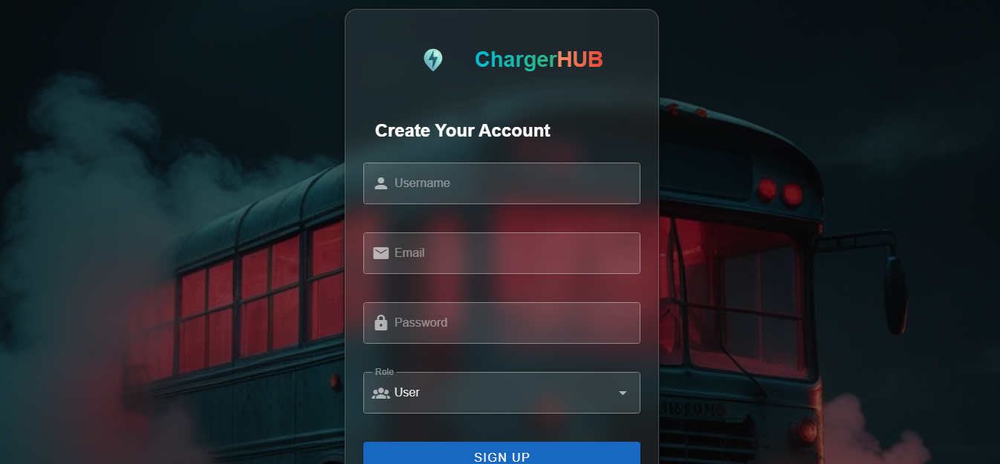

# EV Charging Stations App — Frontend

This is the **frontend** for the EV Charging Stations App, built with **Vue 3**, **Vuetify**, **OpenLayers**, and **Tailwind CSS**.  
It provides a modern, responsive UI for discovering and managing EV charging stations.

---

## ✨ Features

- User registration and login
- Role-based access (admin/user)
- Admins can add, update, and delete charging stations
- Search and filter stations
- Interactive map with attractive station markers (OpenLayers)
- Responsive, modern UI (Vuetify + Tailwind CSS)
- Sidebar overlays for station details and forms

---

## 🚀 Setup Instructions

### 1. Clone the repository (if not already)

```sh
git clone https://github.com/Sachin-fsd/charging-stations-crud
cd charging-stations-crud/frontend
```

### 2. Install dependencies

```sh
npm install
```

### 3. Run the development server

```sh
npm run serve
```

The app will be available at [http://localhost:8080](http://localhost:8080) (default Vue port).

---

## 🛠️ Project Structure

```fs
frontend/
├── public/
│   └── ... (static assets, icons, screenshots)
├── src/
│   ├── assets/
│   ├── components/
│   ├── views/
│   ├── App.vue
│   ├── main.js
│   └── ...
├── package.json
└── ...
```

---

## 🖼️ Screenshots

<p align="center">
  
  
  
</p>

<!-- *_(Add your own screenshots in `public/screenshots/`)_* -->

---

## ⚙️ Configuration

- **API Base URL:**  
  The frontend expects the backend API to be running (see backend setup).  
  If your backend runs on a different host/port, update the API URLs in your code (usually in `src/components/HomeComponent.vue`).

- **Environment Variables:**  
  If you use environment variables, create a `.env` file in the `frontend` directory.

---

## 📦 Build for Production

```sh
npm run build
```

The production-ready files will be in the `dist/` folder.

---

## 📚 Tech Stack

- [Vue 3](https://vuejs.org/)
- [Vuetify](https://vuetifyjs.com/)
- [OpenLayers](https://openlayers.org/)
- [Tailwind CSS](https://tailwindcss.com/)

---
<!-- 
## 📝 License

MIT (or your chosen license) -->

---

## 👤 Author

See [package.json](./package.json) for contributors.

---

<p align="center">
  
</p>
